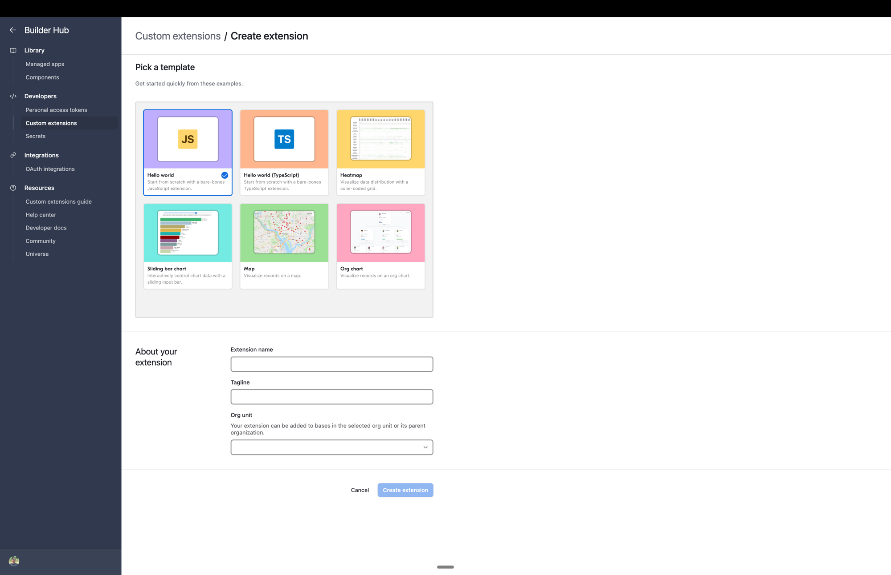
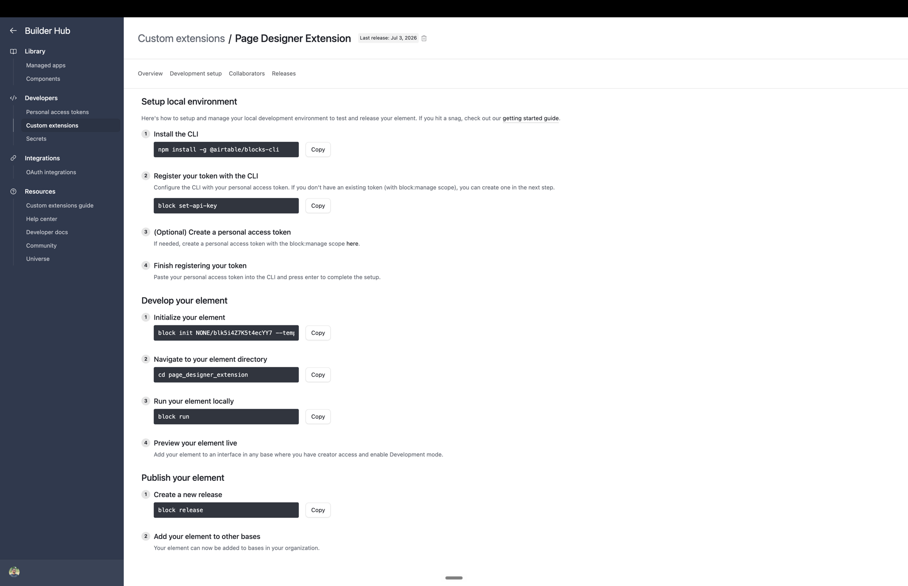

# Page Designer

Design pixel-perfect, printable pages straight from your records, without leaving your Interface. Point it at a table, design one layout, and it renders a page per record that's ready to print or save as PDF. It's the Interface version of the classic Page Designer from Airtable's data layer.

Good for invoices, quotes, and work orders, packing slips and shipping labels, name badges and event tickets, product labels with real barcodes and QR codes, and certificates or spec sheets.

New here? The **[user guide](./GUIDE.md)** walks through every feature — the editor, pages, elements, linked-record tables, inline editing, presenting, and printing.

Want the render-and-print half in one file you can paste into Omni's "Edit source code" editor? See **[`source.tsx`](./source.tsx)** — a self-contained Custom Element with no build step. You author the layout as an in-source constant instead of the drag editor (Omni's source-only sandbox can't persist a design), and barcodes/QR are omitted.

## Features

- Drag, resize, and rotate fields, text, images, lines, barcodes, and QR codes on a real page canvas
- Merge record values into text with `{Field name}`; field values render with the field's own formatting (currency, percent, decimals)
- Linked records as a comma list, a bulleted list, or a table with the columns you pick
- Letter, A4, legal, and slide sizes, page background color, zoom, and a single-page or continuous view
- Multi-select with align and distribute, a snap grid, and undo/redo (Cmd/Ctrl+Z)
- Full-screen **Present** mode: one page per record scaled to fit the screen, arrow/Space/PageUp-PageDown navigation, Esc to exit
- Print that comes out one clean sheet per record, sized to match what you designed
- Barcode and QR libraries are bundled, so rendering works with no runtime CDN dependency

## Get it on your base

This is a **custom interface extension** — it runs on an Interface page (via a Custom element), not in the classic dashboard/extensions panel. You publish it to your own base with Airtable's Blocks CLI, using this repo as the source code:

1. **Create a custom extension.** In Airtable, open **Builder Hub → Custom extensions** (under Developers) and click **Create extension**. On the **Pick a template** screen, keep the default **Hello world** template — this repo's code replaces the scaffold anyway. Give the extension a name, pick the org unit that should be able to add it, and click **Create extension**.

    

    You land on your extension's **Development setup** tab, which lists every command below ready to copy — CLI install, token setup, and the scaffold command with your extension's block ID filled in:

    

    ```bash
    npm install -g @airtable/blocks-cli   # once
    block set-api-key                     # once: paste a personal access token with the block:manage scope
    block init NONE/blkYourBlockId --template=https://github.com/Airtable/interface-extensions-hello-world my_extension
    ```

    After `block init` you have a working scaffold wired to *your* extension, with dependencies installed.

2. **Drop in this code.** Replace the scaffold's `frontend/` folder with the `frontend/` folder from this repo. (If you picked a template other than the default, copy this repo's `block.json` too.)

3. **Release it:**

    ```bash
    block run      # optional: live-develop it on your page first
    block release  # publish it to your base
    ```

4. **Design.** Back in your Interface: point the Custom element at your extension, pick the **table** whose records become pages, hit **Finish**, and lay out your page in edit mode. The published page renders for viewers.

### Custom properties

- **Title.** An optional heading shown above the view.
- **Table.** The table whose records each become a page.

## Working on this repo

It's built on Airtable's interface-extensions **preview SDK** (`@airtable/blocks@interface-alpha`), which is pre-release — expect occasional API drift if you upgrade it. If you edit the Tailwind styles, regenerate the precompiled CSS with `npm run build:css`. Unit tests run with `node --test`.

The committed `package-lock.json` resolves against the public npm registry, so `npm ci` gives you the exact pinned dependency tree.

## Notes

- It renders one page per record from the element's record source.
- It's built for print and PDF output. True 1:1 sizing depends on your browser's print settings (set Margins to None and Scale to 100%), and the view tells you which to set.
- Present mode uses the browser's fullscreen API. If the host doesn't grant the extension fullscreen, it presents within the extension's panel instead of the whole screen.
- The design is meant to be edited by one builder at a time. Concurrent edits are last-write-wins, and your undo history resets if someone else edits the design while you have it open.

## License

MIT No Attribution. See [LICENSE.md](./LICENSE.md).
